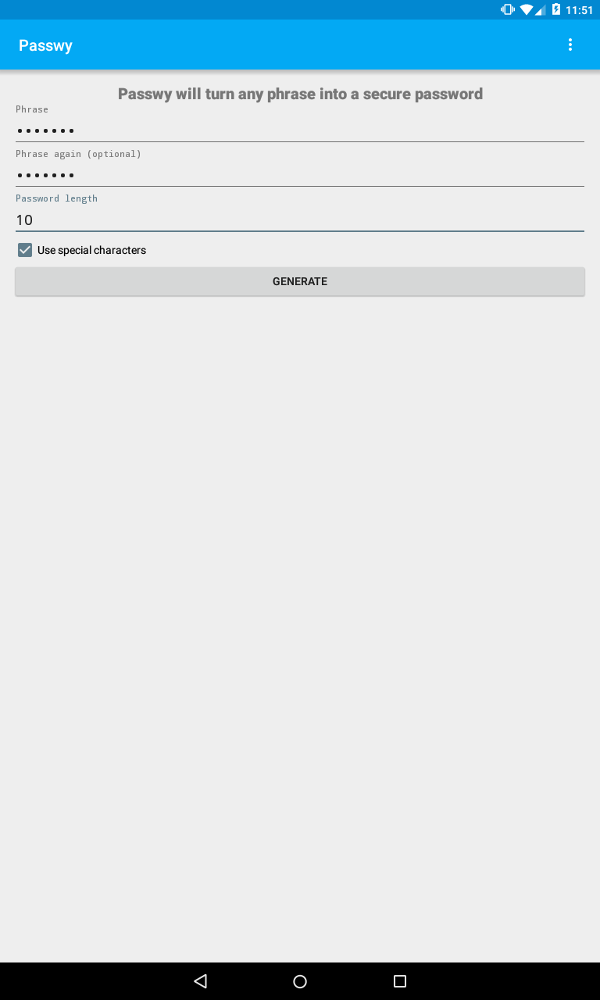
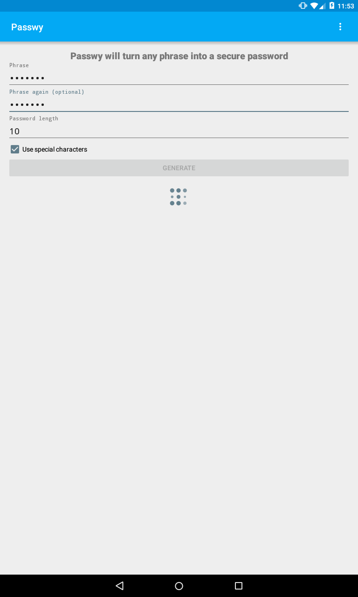
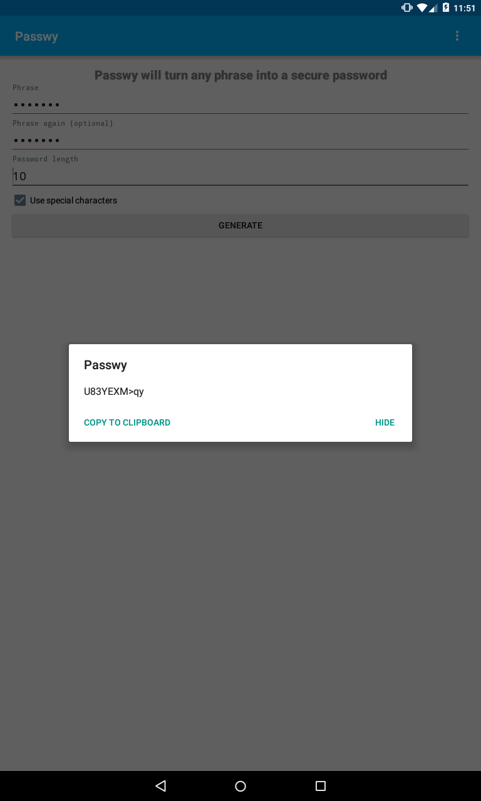

# Passwy


### Android app to create secure password from phrases

Passwy is a simple open sourced Password-Generator app for Android. It doesn't have any useless features or other things that may be bad for your privacy.

Passwy turns any entered phrase into a strong password between 4 and 64 characters long and also gives you the possibility to copy it to the system clipboard. You can use it as a decent system that will allow unique passphrases for every website, such as combining the name or the URL of a website with a phrase that you wouldn't forget.

You are strongly advised to use phrases that are very unique to you. This can be done through including keywords like email addresses, your cat's name or maybe the name of your city. This ensures that your generated password is unique for you.

## Screenshots



## Download

**You can download Passwy on [Google Play](https://play.google.com/store/apps/details?id=jlelse.passwy)**

## Credits

**Developer: [jlelse](http://github.com/jlelse)**

## Used libraries

**[AVLoadingIndicatorView](https://github.com/81813780/AVLoadingIndicatorView)**

**[NineOldAndroids](https://github.com/JakeWharton/NineOldAndroids)**

**[LicensesDialog](https://github.com/PSDev/LicensesDialog)**

## License

Passwy is licensed under the Apache 2.0 license:

```
   Copyright 2015 Jan-Lukas Else

   Licensed under the Apache License, Version 2.0 (the "License");
   you may not use this file except in compliance with the License.
   You may obtain a copy of the License at

       http://www.apache.org/licenses/LICENSE-2.0

   Unless required by applicable law or agreed to in writing, software
   distributed under the License is distributed on an "AS IS" BASIS,
   WITHOUT WARRANTIES OR CONDITIONS OF ANY KIND, either express or implied.
   See the License for the specific language governing permissions and
   limitations under the License.
```